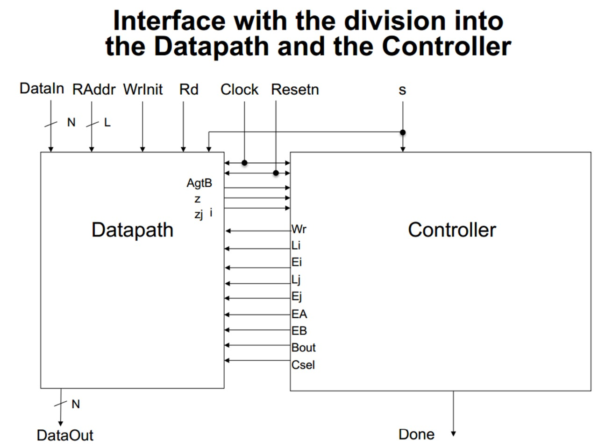
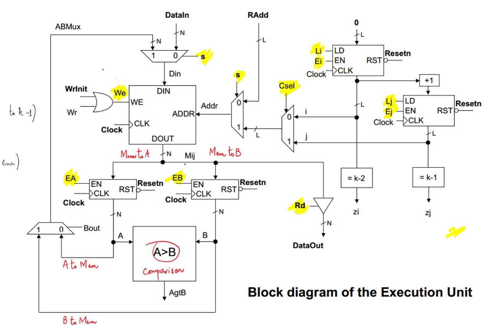
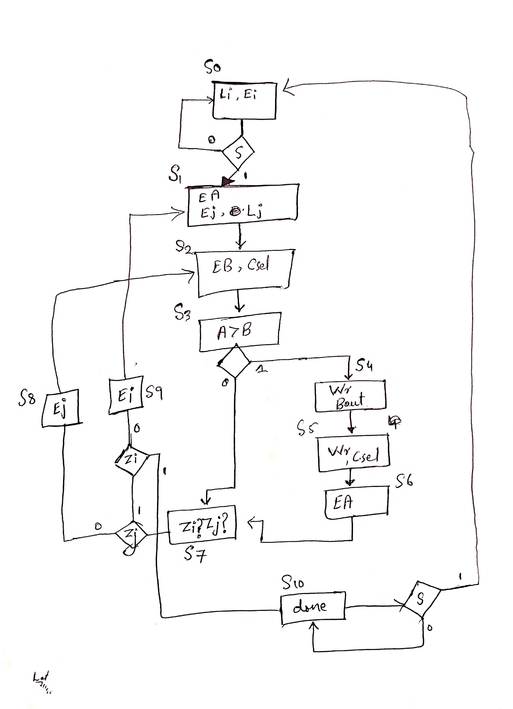

# Sorting Algorithm Implementation in Verilog

This project implements a hardware-based **sorting algorithm** using Verilog, featuring a **controller, datapath, RAM module, and testbench**. The design ensures correct operation with **proper signal synchronization** and **state transitions**.

## 📌 Features
- **Fully synchronous design** with clock and reset.
- **RAM-based data storage** for sorting elements.
- **Finite State Machine (FSM) Controller** to handle sorting logic.
- **Comparator-based swap logic** for sorting elements in ascending order.
- **Testbench with predefined data** for verification.

## 📁 Project Architecture

# Datapath and Controller Interface

# Block Diagram of Execution Unit

# FSM Controller

# Datapath

## 🚀 How It Works

1. **Initialization**:  
   - The RAM is loaded with predefined values.
   - Sorting starts when the `start` signal is asserted.

2. **Sorting Process**:  
   - Uses a **finite state machine (FSM)** to control the sorting logic.
   - Implements a **swap-based algorithm** where elements are compared and swapped if needed.
   - Iterates through the elements until sorting is complete.

3. **Completion**:  
   - The `done` signal is asserted when sorting is finished.
   - RAM contents can be read to verify the sorted order.

## 🛠️ Simulation & Testing
We are using **SystemVerilog**, we will run the simulation using **Vivado XSIM**.

### 1️⃣ Running the Simulation
1. Open **Vivado 2018.2**.
2. Load the project or create a new one.
3. Ensure all **SystemVerilog files** (`.sv`) are added to the project.

### 2️⃣ Set Up Simulation
- In the **Flow Navigator**, go to **Simulation → Simulation Settings**.
- Under **Compilation Options**, enable **SystemVerilog** support.
- Set **Simulation Run Time** (e.g., `10ns`).
- Choose **Behavioral Simulation**.

### 3️⃣ Run the Simulation
- Click **Run Simulation → Run Behavioral Simulation**.
- Use Vivado’s **Waveform Viewer** to inspect results.

### 4️⃣ Debugging & Analysis
- Check the **console** for errors/warnings.
- Add **signals** to the waveform for better visibility.
- Use `assertions` and `$display` for debugging.

## ✅ Why Use SystemVerilog?
- Supports **object-oriented testbenches**.
- More **advanced assertions & functional coverage**.
- Easier to write **self-checking testbenches**.
